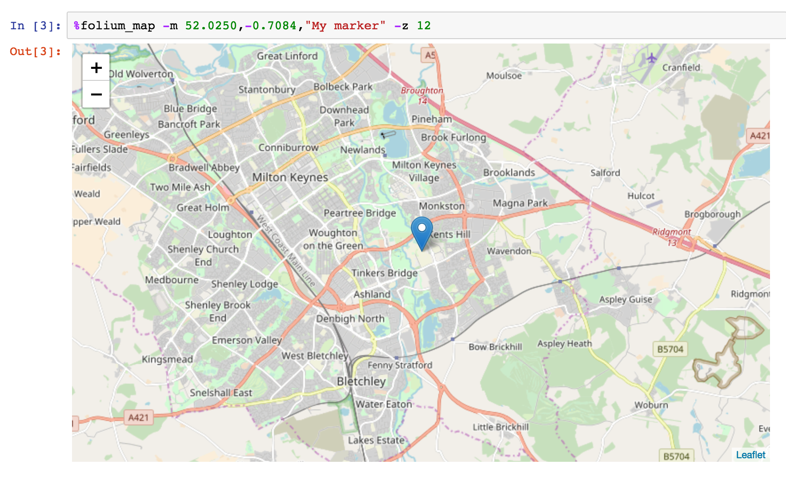
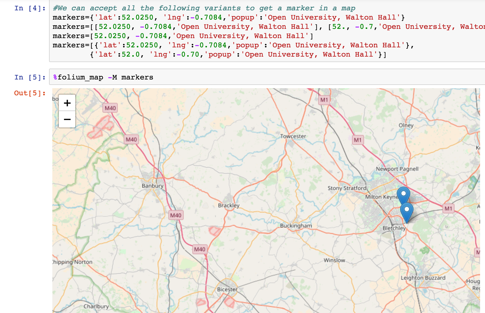
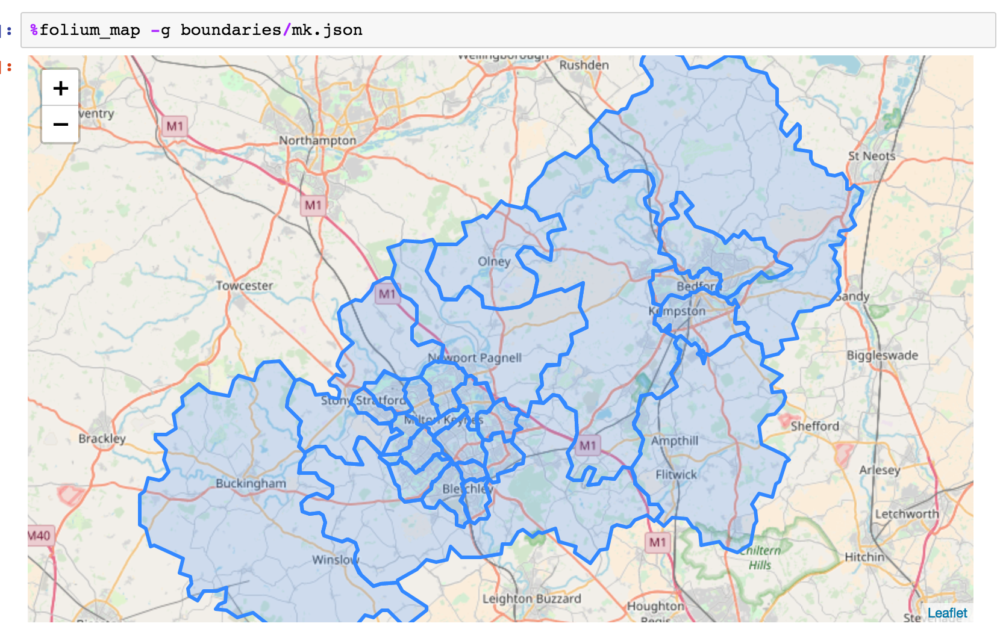
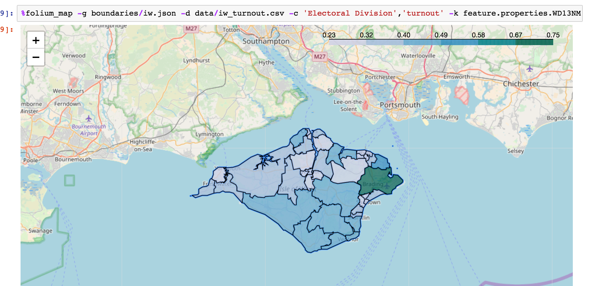

# ipython_magic_folium

IPython Magic for [`folium` maps](https://github.com/python-visualization/folium).

This extension provides magic form embedding maps in Jupyter notebooks using `folium`.

To install:

`pip install git+https://github.com/psychemedia/ipython_magic_folium.git`

To load the magic in a Jupyter notebook:

`%load_ext folium_magic`

Then call as: `%folium_map`

The magic currently only works as cell magic.

See the `folium_magic_demo.ipynb` notebook for examples, or run using *Binder*.

### Display Map

- `-l`, `--latlong`: latitude and longitude values, comma separated. If no value is provided a default location will be used;
- `-z`, `--zoom` (`default=10`): set initial zoom level;

### Add markers

- `-m`, `--marker`: add a single marker, passed as a comma separated string with no spaces after commas; eg `52.0250,-0.7084,"My marker"`

- `-M`,`--markers`: add multiple markers from a Python variable; pass in the name of a variable that refers to:
  - a single dict, such as `markers={'lat':52.0250, 'lng':-0.7084,'popup':'Open University, Walton Hall'}`
  - a single ordered list, such as `markers=[52.0250, -0.7084,'Open University, Walton Hall']`
  - a list of dicts, such as `markers=[{'lat':52.0250, 'lng':-0.7084,'popup':'Open University, Walton Hall'},{'lat':52.0, 'lng':-0.70,'popup':'Open University, Walton Hall'}]`
  - a list of ordered lists, such as `markers=[[52.0250, -0.7084,'Open University, Walton Hall'], [52., -0.7,'Open University, Walton Hall']]`

### Display `geojson` file

- `-g`, `--geojson`: path to a geoJSON file

### Display a Choropleth Map

A choropoleth map is displayed if enough information is provided to disaplay one.

- `-g`/ `--geojson`: path to a geoJSON file
- `-d`, `--data`: the data source, either in the form of a `pandas` dataframe, or the path to a csv data file
- `-c`, `--columns`: comma separated (no space after comma) column names from the data source that specify: *column to match geojson key,column containing values to display*
- `-k`, `--key`: key in geojson file to match areas with data values in data file;
- optional:
  - `-p`, `--palette`: default=`'PuBuGn'`
  - `-o`, `--opacity`: default=`0.7`

