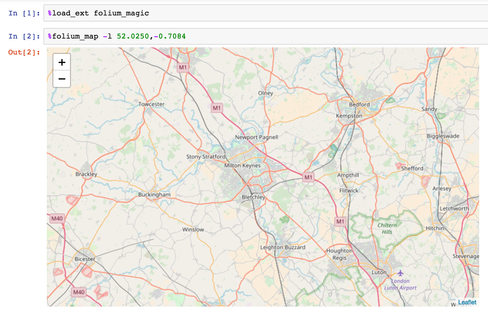
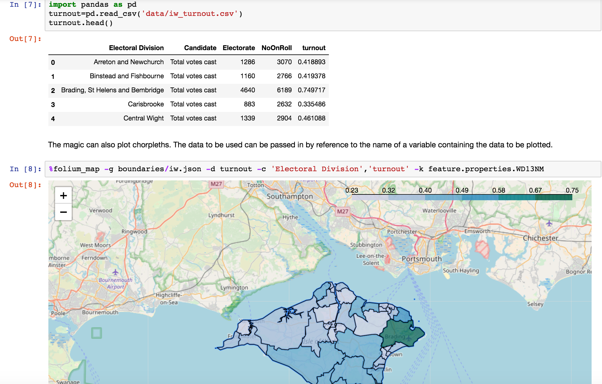

# ipython_magic_folium

IPython Magic for [`folium` maps](https://github.com/python-visualization/folium).

This extension provides magic form embedding maps in Jupyter notebooks using `folium`.

To install:

`pip install git+https://github.com/psychemedia/ipython_magic_folium.git`

To load the magic in a Jupyter notebook:

`%load_ext folium_magic`

Then call as: `%folium_map`

The magic currently only works as line magic.

See the `folium_magic_demo.ipynb` notebook for examples, or run using *Binder*.

[](https://mybinder.org/v2/gh/psychemedia/ipython_magic_folium/master?filepath=folium_magic_demo.ipynb)

### Create a Map or Build on an Existing Map

- No arguments - create a default map; the magic return s a `folium` map object which can be rendered if the line magic is the last item in a code cell, or assigned to a variable; if the previously executed cell output (that is, the contents of the IPython `_` variable is a `folium` map, that map will be used as the starting map).
- `-b`, `--basemap`: pass in the name of a variable whose value is set to an existing `folium` map; to override the automatic reuse of previous maps, set `-b None`.

If a map is constructed from a previous map, if a new zoom level and/or new centre location is defined, those details will be used to plot the updated map.

### Display Map

- `-l`, `--latlong`: latitude and longitude values, comma separated. If no value is provided a default location will be used;
- `-z`, `--zoom` (`default=10`): set initial zoom level;



### Add markers

- `-m`, `--marker`: add a single marker, passed as a comma separated string with no spaces after commas; eg `52.0250,-0.7084,"My marker"`


- `-M`,`--markers`: add multiple markers from a Python variable; pass in the name of a variable that refers to:
  - a single dict, such as `markers={'lat':52.0250, 'lng':-0.7084,'popup':'Open University, Walton Hall'}`
  - a single ordered list, such as `markers=[52.0250, -0.7084,'Open University, Walton Hall']`
  - a list of dicts, such as `markers=[{'lat':52.0250, 'lng':-0.7084,'popup':'Open University, Walton Hall'},{'lat':52.0, 'lng':-0.70,'popup':'Open University, Walton Hall'}]`
  - a list of ordered lists, such as `markers=[[52.0250, -0.7084,'Open University, Walton Hall'], [52., -0.7,'Open University, Walton Hall']]`


If no `-l` co-ordinate is set to centre the map, the co-ordinates of the single marker, or the mid-point of the multiple markers, are used instead.

### Display `geojson` file

- `-g`, `--geojson`: path to a geoJSON file


If no `-l` co-ordinate is set to centre the map, the mid-point of the geojson boundary is used instead.

### Display a Choropleth Map

A choropoleth map is displayed if enough information is provided to disaplay one.

- `-g`, `--geojson`: path to a geoJSON file
- `-d`, `--data`: the data source, either in the form of a `pandas` dataframe, or the path to a csv data file
- `-c`, `--columns`: comma separated (no space after comma) column names from the data source that specify: *column to match geojson key,column containing values to display*
- `-k`, `--key`: key in geojson file to match areas with data values in data file;
- optional:
  - `-p`, `--palette`: default=`'PuBuGn'`
  - `-o`, `--opacity`: default=`0.7`




### Adding Additional Layers

Example: 

```
x = %folium_map -m 52.0250,-0.7084,"My marker"
%folium_map -b x -m 52.02,-0.708,"My other marker"
```

## Helper Magic

The `%geo_suggester` magic provides assistance for determing what columns may be appropriate in data files, and what properties may be appropriate in geojson files, for plotting choropleth maps:

`%geo_suggester -g boundaries/iw.json`

`%geo_suggester -d data/iw_turnout.csv`

`%geo_suggester -g boundaries/iw.json -d data/iw_turnout.csv`